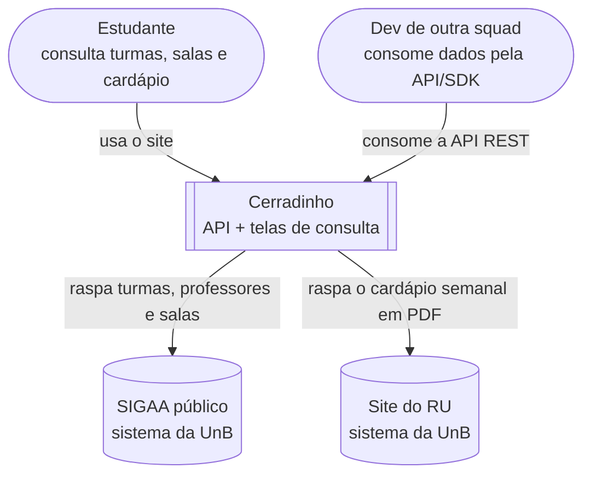
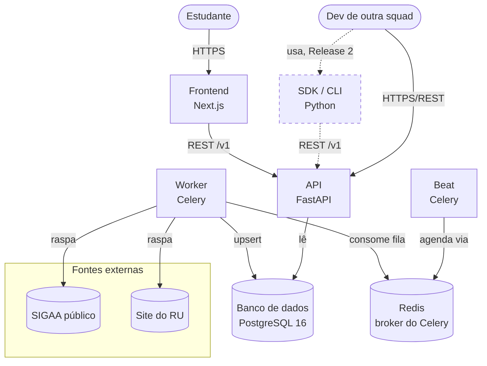
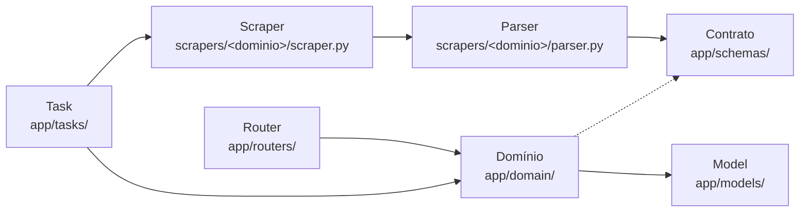
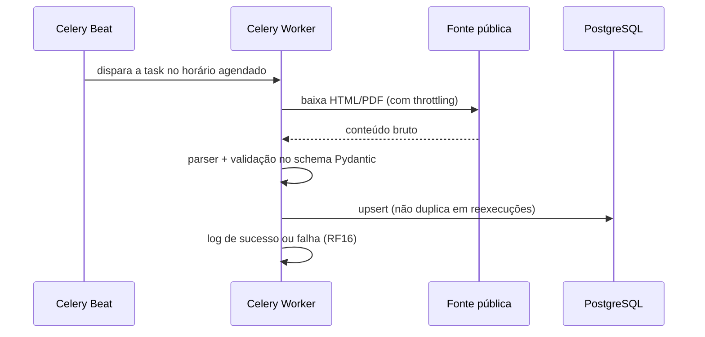
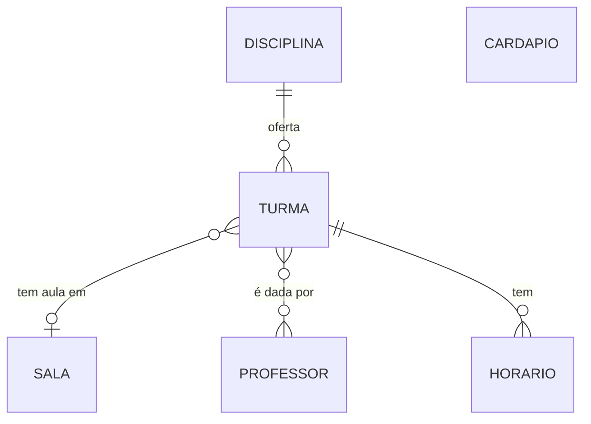

# Arquitetura — Cerradinho

Como o sistema é construído. O que ele precisa fazer está em [REQUISITOS.md](REQUISITOS.md); as decisões técnicas e seus motivos estão nos [ADRs](adr/).

Documentada no modelo **C4**: Contexto (quem usa o sistema e com que outros sistemas ele conversa), Container (as peças que rodam de verdade e como se comunicam) e Componente (como uma dessas peças é organizada por dentro).

## Visão geral

A coleta e a API são separadas: scrapers agendados gravam no PostgreSQL, e a API só lê do banco. Uma requisição à API nunca depende de o SIGAA ou o site do RU estarem no ar naquele momento ([ADR 0004](adr/0004-coleta-desacoplada-da-api.md)).

## Nível 1 — Contexto

Quem usa o Cerradinho e com quais sistemas externos ele troca dado. Sem detalhe de tecnologia — isso só aparece no Nível 2.



As personas (Estudante, Dev de outra squad) estão detalhadas no [Documento de Visão](DOCUMENTO-VISAO.md). Eventos e editais entram como fontes externas adicionais na Release 2 (ver [REQUISITOS.md](REQUISITOS.md)).

## Nível 2 — Container

As peças que rodam de verdade, cada uma com seu próprio processo/deploy, e como conversam entre si.



| Container | Tecnologia | Responsabilidade | Release |
|---|---|---|---|
| Frontend | Next.js, Axios, Tailwind | Telas de consulta que consomem a API | R1 |
| API | FastAPI | Expor os dados via REST versionado, só leitura do banco | R1 |
| Worker | Celery | Rodar as tasks de scraping (captura, parse, upsert no banco) | R1 |
| Beat | Celery | Disparar as tasks de scraping nos horários agendados | R1 |
| Banco de dados | PostgreSQL 16, SQLAlchemy 2, Alembic | Guardar os dados normalizados | R1 |
| Redis | Redis 7 | Broker/backend do Celery (fila de tasks); cache de respostas da API entra na Release 2 | R1 (broker), R2 (cache) |
| SDK / CLI | Python, Typer | Cliente que encapsula chamadas HTTP à API pra integração de terceiros | R2 |

Worker e Beat rodam como processos Celery separados (`celery_worker` e `celery_beat` no `docker-compose.yml`), mas compartilham o mesmo código-fonte do backend.

## Nível 3 — Componente

Como o container **Backend** (API + Worker + Beat, mesmo código-fonte) é organizado por dentro.



| Componente | Pasta | Pode | Não pode |
|---|---|---|---|
| Scraper | `app/scrapers/<dominio>/scraper.py` | Acessar a fonte e devolver o conteúdo bruto | Parsear, gravar no banco |
| Parser | `app/scrapers/<dominio>/parser.py` | Transformar o conteúdo bruto no contrato Pydantic | Acessar rede ou banco |
| Contrato | `app/schemas/` | Definir o formato validado que sai do scraper | Ter regra de negócio |
| Domínio | `app/domain/` | Normalizar, persistir e montar respostas | Conhecer HTTP |
| Model | `app/models/` | Mapear as tabelas (SQLAlchemy) | Ter regra de negócio |
| Router | `app/routers/` | Receber a requisição e chamar o domínio | Consultar o banco direto, fazer scraping |
| Task | `app/tasks/` | Orquestrar scraper → parser → domínio | Ter regra de negócio |

Os schemas de resposta que diferem do contrato do scraper ficam em `app/schemas/api/` (por exemplo, `Docente` e `Espaco`).

## Fluxo de coleta

Diagrama de sequência (fora dos 3 níveis do C4, complementar): como uma task agendada percorre os componentes do Nível 3.



| Task | Fonte | Quando roda |
|---|---|---|
| `scrape_disciplinas_task` | SIGAA, todas as unidades | Domingo, 3h (`America/Sao_Paulo`) |
| `scrape_cardapio_task` | PDF semanal do RU (Darcy Ribeiro) | Todo dia, 5h |

O agendamento fica em `backend/app/celery_app.py`. O período letivo (`ano`/`periodo`) da task de disciplinas é fixo no código e precisa ser atualizado a cada semestre, porque o SIGAA público não expõe o período corrente.

## Rotas da API

Todas sob `/v1/` ([ADR 0005](adr/0005-api-versionada-desde-o-inicio.md)). A documentação completa, com exemplos, fica em `/docs` com a API rodando.

| Rota | Retorna |
|---|---|
| `GET /v1/disciplinas` | Turmas com professores, horários, sala e vagas |
| `GET /v1/professores` | Docentes e os códigos das disciplinas de cada um |
| `GET /v1/salas` | Salas com prédio e nome separados |
| `GET /v1/cardapio/semana?data_inicio=` | Itens do cardápio de 7 dias, por refeição e categoria |

## Modelo de dados

Fora dos 3 níveis do C4 — detalhe de dado, não de estrutura do sistema.



`Turma` é única por (disciplina, número, ano/período), o que permite reexecutar o scraper sem duplicar. `Cardapio` guarda um dia por linha, com café, almoço e jantar em texto.

## Estrutura de pastas

```
2026-2-Cerradinho-API/
├── backend/
│   ├── app/
│   │   ├── core/          # configuração e sessão do banco
│   │   ├── domain/        # regras de negócio e persistência
│   │   ├── models/        # SQLAlchemy
│   │   ├── routers/       # rotas /v1
│   │   ├── schemas/       # contratos Pydantic (api/ = respostas da API)
│   │   ├── scrapers/      # um pacote por fonte (scraper + parser)
│   │   ├── tasks/         # tasks Celery e sinais de log
│   │   ├── celery_app.py  # agendamento
│   │   └── main.py        # app FastAPI
│   ├── alembic/           # migrations
│   └── tests/             # unit, contract, integration, routers, scrapers, tasks
├── frontend/
│   ├── app/               # páginas (App Router)
│   ├── components/        # componentes visuais
│   ├── hooks/             # chamadas à API, isoladas das telas
│   └── lib/               # cliente Axios
├── sdk/                   # SDK/CLI Python (Release 2)
├── docs/                  # documentação (índice em docs/indice-completo.md)
├── .github/               # CI, templates de issue e PR
└── docker-compose.yml     # db, migrate, api, redis, celery_worker, celery_beat
```

## Infraestrutura e qualidade

Não são containers C4 (não são peças do sistema em si), mas sustentam a operação e a entrega.

| Item | Tecnologia | Papel | Release |
|---|---|---|---|
| CI | GitHub Actions, ruff, bandit, pytest, schemathesis | Lint, SAST, testes unitários/contrato/integração a cada push | R1 |
| Documentação da API | OpenAPI/Swagger (gerado pelo FastAPI) | Referência interativa das rotas, em `/docs` | R1 |
| Rate limit | slowapi | Limitar requisições por cliente (middleware da API) | R2 |
| Observabilidade | UptimeRobot | Monitorar uptime das fontes e da API, com alerta | R2 |
| Hospedagem | Railway | Ambiente de produção da API, banco, Redis e worker | R2 |

## Decisões de arquitetura

Cada decisão relevante tem um ADR em [`docs/adr/`](adr/):

| ADR | Decisão |
|---|---|
| [0001](adr/0001-base-tecnica-backend.md) | Python 3.12, SQLAlchemy síncrono, `requirements.txt` |
| [0002](adr/0002-ferramentas-de-scraping.md) | Playwright para o SIGAA; requests + BeautifulSoup/pdfplumber para as demais fontes |
| [0003](adr/0003-celery-e-redis-para-agendamento.md) | Celery e Redis para o agendamento |
| [0004](adr/0004-coleta-desacoplada-da-api.md) | Coleta desacoplada da API |
| [0005](adr/0005-api-versionada-desde-o-inicio.md) | API versionada desde o início (`/v1/`) |
| [0006](adr/0006-salas-derivadas-das-turmas.md) | Salas derivadas das turmas, sem scraper próprio |
| [0007](adr/0007-cache-e-rate-limit-na-api.md) | Cache e rate limit na camada da API |
| [0008](adr/0008-bandit-como-sast.md) | Bandit como análise estática de segurança |
| [0009](adr/0009-railway-para-deploy.md) | Railway para hospedagem |

Os padrões de código (separação de camadas, nomenclatura, tratamento de erro) estão no [CONTRIBUTING.md](https://github.com/unb-mds/2026-2-Cerradinho-API/blob/dev/CONTRIBUTING.md).
